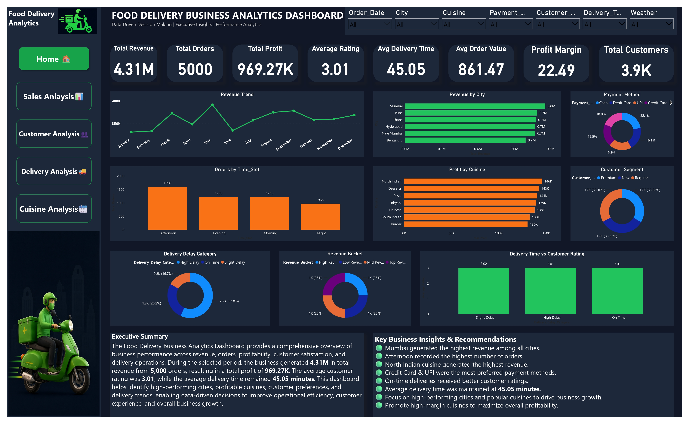
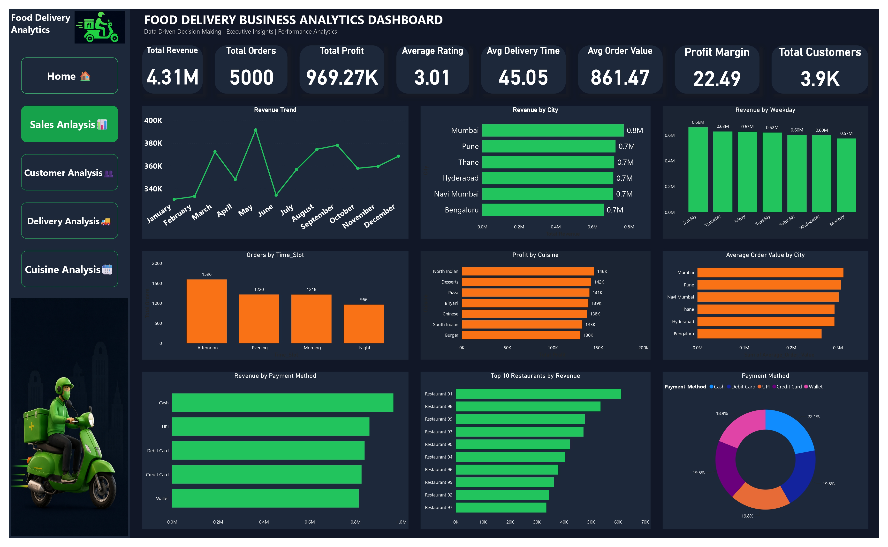
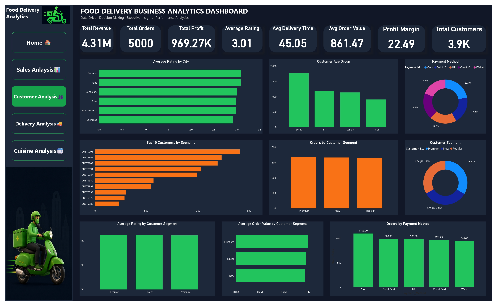
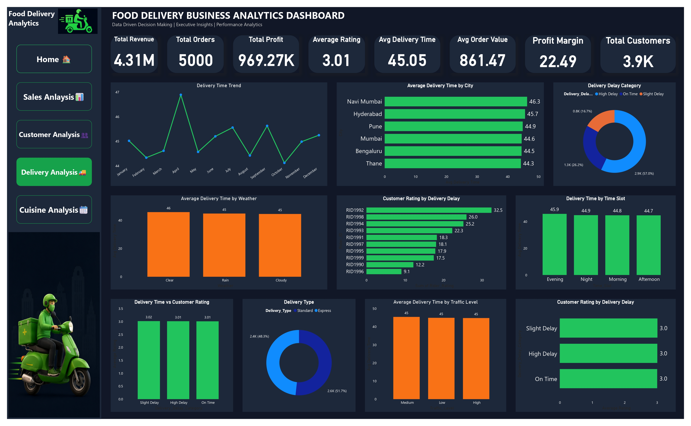

# Food Delivery Business Analytics Dashboard

A professional business intelligence project designed to transform raw food delivery data into actionable insights through an interactive Power BI dashboard. This initiative focuses on uncovering patterns in revenue performance, customer behavior, delivery efficiency, and cuisine trends to support strategic decision-making for a growing food delivery business.


---

## Table of Contents

- [Project Overview](#project-overview)
- [Business Problem](#business-problem)
- [Objectives](#objectives)
- [Dataset Information](#dataset-information)
- [Project Workflow](#project-workflow)
- [Features](#features)
- [Tech Stack](#tech-stack)
- [Dashboard Overview](#dashboard-overview)
- [Dashboard Pages](#dashboard-pages)
- [Business Insights](#business-insights)
- [Key Findings](#key-findings)
- [Recommendations](#recommendations)
- [Folder Structure](#folder-structure)
- [How to Run](#how-to-run)
- [Requirements](#requirements)
- [Future Improvements](#future-improvements)
- [Skills Demonstrated](#skills-demonstrated)
- [Author](#author)
- [GitHub](#github)
- [LinkedIn](#linkedin)
- [License](#license)

---

## Project Overview

This project presents a comprehensive Power BI dashboard for analyzing the performance of a food delivery business using a realistic dataset containing over 5,000 transactions and more than 40 features. The dashboard is designed to deliver a high-level executive summary while also supporting deeper analysis across sales, customers, deliveries, and cuisine performance.

The solution demonstrates how business data can be transformed into a visually compelling and decision-oriented reporting experience. It combines data cleaning, transformation, modeling, and visualization to create an end-to-end analytics workflow suitable for modern business reporting and strategic planning.

The dashboard serves as both a technical showcase and a business storytelling asset, highlighting how data-driven insights can improve revenue management, operational efficiency, customer satisfaction, and market understanding.

---

## Business Problem

Food delivery businesses operate in a highly competitive environment where small performance improvements can significantly impact growth and profitability. Without a centralized view of customer behavior, revenue patterns, delivery performance, and cuisine-level demand, decision-making becomes fragmented and reactive.

Key business challenges addressed in this project include:

- Limited visibility into revenue trends and regional performance
- Difficulty identifying high-value customer segments
- Inconsistent understanding of delivery delays and service quality
- Lack of insight into cuisine profitability and popularity
- Need for a single dashboard that supports strategic and operational decisions

This project solves these challenges by presenting a unified and interactive analytics experience that makes performance indicators easy to understand and act upon.

---

## Objectives

The primary objectives of this project were to:

1. Build an interactive and visually professional analytics dashboard in Power BI.
2. Clean and prepare raw food delivery data for reliable business analysis.
3. Analyze revenue contributions, order patterns, and customer behavior.
4. Evaluate operational performance including delivery time and delay categories.
5. Explore cuisine-based profitability and popularity trends.
6. Create a portfolio-ready project that showcases data analytics and business intelligence expertise.

The dashboard was developed not only to visualize data, but also to communicate business implications clearly and effectively.

---

## Dataset Information

The project uses a realistic food delivery dataset containing 5,000 rows and 40+ columns. The data includes a wide range of business and operational variables that support rich analytical exploration.

### Dataset Highlights

- Transaction-level food delivery records
- Customer demographic and behavioral attributes
- Revenue, profit, order, and rating metrics
- Delivery timing and performance indicators
- Cuisine and restaurant-related details
- Multiple payment methods and city-based segmentation

### Key Data Dimensions

| Dimension        | Description                                             |
| ---------------- | ------------------------------------------------------- |
| Revenue          | Total earnings generated from orders                    |
| Profit           | Net business profit from transactions                   |
| Orders           | Number of completed purchase transactions               |
| Rating           | Customer satisfaction score                             |
| Delivery Time    | Time taken to deliver orders                            |
| City             | Geographic segment for revenue and performance analysis |
| Payment Method   | Preferred transaction method used by customers          |
| Cuisine          | Food category associated with each order                |
| Customer Segment | Grouping of customers based on behavior and value       |

This dataset provides a strong foundation for building a meaningful business analytics narrative with real-world relevance.

---

## Project Workflow

The project workflow followed a structured data analytics lifecycle:

1. Data Collection and Review
   - Imported the food delivery dataset from CSV format.
   - Reviewed the structure, quality, and business relevance of the data.

2. Data Cleaning and Preparation
   - Handled missing or inconsistent values.
   - Standardized categorical fields and formatting.
   - Prepared a clean dataset for modeling.

3. Data Transformation with Power Query
   - Applied transformations to shape and enrich the dataset.
   - Structured fields to improve analysis and visualization readiness.

4. Data Modeling and DAX Measures
   - Created calculated metrics for revenue, profit, average order value, and delivery performance.
   - Built relationships and support measures for dashboard logic.

5. Dashboard Design and Visualization
   - Designed a professional and intuitive user experience.
   - Developed KPI-driven pages aligned with business priorities.

6. Insight Generation and Reporting
   - Interpreted trends and translated them into business understanding.
   - Summarized key findings for strategic recommendations.

---

## Features

The dashboard includes a robust set of analytics features tailored for business intelligence use:

- Executive-level KPI overview for quick decision support
- Revenue and profit trend analysis over time
- City-based revenue and performance comparison
- Customer segmentation and value analysis
- Delivery delay and performance insights
- Cuisine profitability and popularity assessment
- Interactive visuals for drill-down and exploration
- Professional presentation suitable for stakeholder review
- Business-oriented storytelling through visual summaries

These features make the dashboard useful for both management reporting and operational analysis.

---

## Tech Stack

| Tool / Technology     | Purpose                                                      |
| --------------------- | ------------------------------------------------------------ |
| Power BI              | Dashboard development, visualization, and business reporting |
| Power Query           | Data cleaning, transformation, and shaping                   |
| DAX                   | Calculated measures, KPIs, and analytical logic              |
| Excel / CSV           | Data source and structured business data handling            |
| Data Cleaning         | Preparation of high-quality analytical data                  |
| Data Analysis         | Trend detection, segmentation, and insight extraction        |
| Business Intelligence | Translating data into actionable business decisions          |

This project demonstrates strong proficiency in the full analytics workflow from raw data to impactful visual storytelling.

---

## Dashboard Overview

The final dashboard offers a polished and professional business reporting experience. It combines strategic metrics and detailed analytical views to present the performance of the food delivery business from multiple perspectives.

The design emphasizes clarity, decision support, and executive readability. Important metrics such as revenue, profit, orders, customer ratings, and delivery efficiency are brought together in an intuitive format that allows users to quickly identify opportunities and pressures across the business.

The dashboard is particularly useful for:

- Business leaders and stakeholders
- Operations and delivery teams
- Sales and customer strategy teams
- Analytics and reporting professionals
- Portfolio presentation and interview discussions

---

## Dashboard Pages

### Home Dashboard



This landing page provides a high-level business overview with visually rich KPI cards and executive summary sections. It highlights core performance indicators such as:

- KPI Cards
- Revenue
- Orders
- Profit
- Rating
- Delivery Time
- Revenue Trend
- Revenue by City
- Payment Method
- Executive Summary
- Business Insights

The Home page is designed to give stakeholders a quick and effective snapshot of the business performance at a glance.

### Sales Analysis



This page focuses on revenue and sales performance across multiple dimensions. It presents an in-depth view of:

- Revenue Trend
- Revenue by City
- Revenue by Weekday
- Orders by Time Slot
- Profit by Cuisine
- Average Order Value by City
- Revenue by Payment Method
- Top Restaurants
- Payment Distribution

This analysis helps identify growth opportunities, customer purchasing behavior, and high-performing restaurant or city segments.

### Customer Analysis



This page explores customer-centric performance and engagement. It includes insight into:

- Customer Segments
- Customer Age Groups
- Customer Ratings
- Top Customers
- Average Rating
- Average Order Value
- Payment Methods

The customer analysis component helps uncover audience preferences, satisfaction patterns, and potential opportunities to improve retention and revenue per customer.

### Delivery Analysis



This page evaluates operational performance and delivery effectiveness. Key areas covered include:

- Delivery Time Trend
- Delay Categories
- Weather Analysis
- Traffic Analysis
- Delivery Type
- Delivery Performance

This section is particularly valuable for identifying service bottlenecks, understanding environmental factors, and improving logistics execution.

### Cuisine Analysis


This page explores culinary performance from a business perspective. It highlights:

- Revenue by Cuisine
- Profit by Cuisine
- Cuisine Popularity
- Profit Margin
- Orders by Cuisine
- Heatmap
- Top Restaurants

The cuisine analysis section supports decisions around menu strategy, promotional focus, and category-level profitability.

---

## Business Insights

The dashboard delivers several meaningful business insights that extend beyond simple reporting. It uncovers patterns that can guide strategy, service improvement, and customer-focused growth initiatives.

The presentation is built to support both operational and strategic conversations, making it easier to understand where the business is performing well and where attention is needed.

---

## Key Findings

Some of the major insights reflected in the dashboard include:

- Revenue and orders show clear temporal and regional trends
- Specific cities contribute disproportionately to total revenue
- Certain customer segments generate higher order value and engagement
- Delivery performance varies based on traffic, weather, and time conditions
- Cuisine categories differ significantly in profitability and popularity
- Payment methods influence customer behavior and transaction patterns
- Customer satisfaction metrics provide important signals for service improvement

These insights are presented in a way that aligns strongly with real-world business decision-making needs.

---

## Recommendations

Based on the dashboard findings, the following strategic actions are recommended:

- Focus marketing and promotional efforts on high-performing cities and customer segments
- Improve delivery operations in regions or time periods with frequent delays
- Prioritize cuisines with strong profit margins and growing demand
- Strengthen customer retention strategies for high-value customers
- Monitor customer ratings and service issues to improve customer satisfaction
- Use payment-method insights to optimize checkout experience and conversion
- Expand analysis into forecasting and predictive planning for future growth

These recommendations support a data-informed strategy for improving both business performance and customer experience.

---

## Folder Structure

```text
Food_Delivery_Analysis/
│
├── Dashboard.pbix
├── Food_Delivery_Analysis_Dashboard.pdf
├── food_delivery_clean_updated.csv
├── Food_Delivery_Analysis.ipynb
├── Home.jpg
├── Sales_Analysis.jpg
├── Customer_Analysis.jpg
├── Delivery_Analysis.jpg
├── Cuisine_Analysis.jpg
├── Logo.png
└── README.md
```

---

## How to Run

To explore the project locally:

1. Open the Power BI file named Dashboard.pbix in Power BI Desktop.
2. Ensure that the data source file food_delivery_clean_updated.csv is available in the project folder.
3. Review the dashboard pages and interact with visuals to explore different business insights.
4. Optionally open the PDF version for a presentation-friendly snapshot of the dashboard.

If you are using the notebook file, you can also review the analytical workflow and data preparation steps in Food_Delivery_Analysis.ipynb.

---

## Requirements

To work with this project, you should have:

- Power BI Desktop installed
- Basic knowledge of Power Query and DAX
- Access to the included CSV dataset
- A working environment for viewing and editing the dashboard

For presentation purposes, a PDF viewer may also be useful for reviewing the exported dashboard report.

---

## Future Improvements

Potential enhancements for future versions of this project include:

- Adding interactive filters and drill-through pages
- Integrating forecasting and predictive analytics
- Creating a real-time dashboard connection to live data
- Expanding the dashboard with a mobile-optimized layout
- Adding customer lifetime value and retention analysis
- Including automated anomaly detection for unusual sales or delivery patterns
- Publishing the dashboard to Power BI Service for online collaboration

These improvements would further strengthen the project’s value for business reporting and analytics leadership.

---

## Skills Demonstrated

This project showcases a strong combination of technical and business-oriented skills, including:

- Data cleaning and preparation
- Power Query transformation techniques
- DAX measure creation and business logic implementation
- Dashboard design and visual storytelling
- Business analysis and insight communication
- Executive reporting and KPI development
- Data-driven decision support
- Portfolio-ready analytics presentation

---

## Author

Siddhesh Pravin Patil

---

## License

This project is open for educational and portfolio use.

If you would like to reuse or adapt this project, please provide appropriate credit to the author and project repository.
